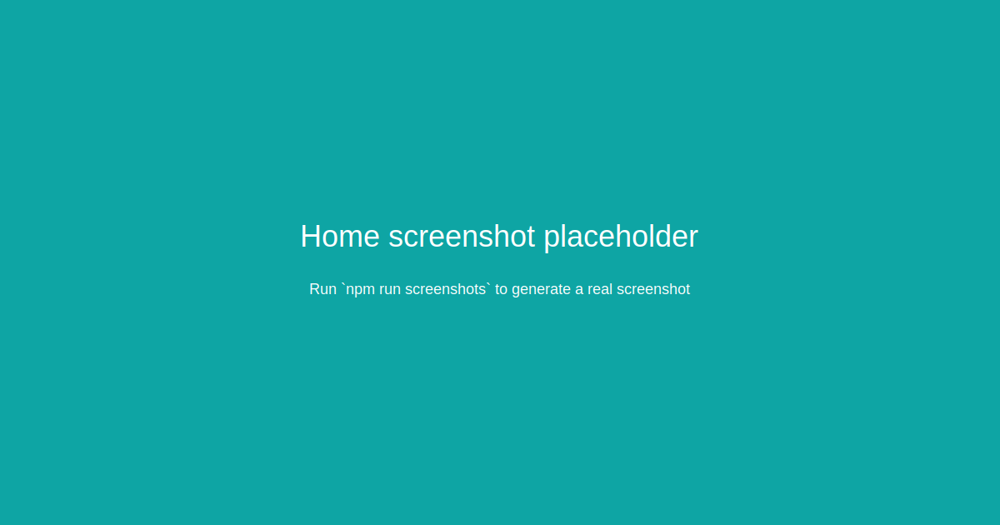

# Lazorkit Passkey Starter

> The canonical starter repository for building passkey-based smart wallets on Solana with Lazorkit.


---

## Screenshots

Home page screenshot (generated with Playwright):



To generate screenshots locally:

1. Start the app: `npm run dev`
2. Run: `npm run screenshots` (creates `docs/screenshots/home.png`)


This repository demonstrates how to integrate [Lazorkit](https://github.com/lazor-kit/lazor-kit) SDK to create production-ready passkey wallets that enable gasless transactions. It's designed as a reference implementation that developers can clone and extend for their own projects.

## What This Repo Demonstrates

Lazorkit enables a new paradigm for Solana wallets:

- **Passkey Authentication**: Replace seed phrases with WebAuthn biometrics (FaceID, TouchID, Windows Hello)
- **Smart Wallets**: Programmable accounts controlled by passkeys, not direct transaction signing
- **Gasless Transactions**: Fee sponsorship via paymasters for Web2-like UX
- **Session Persistence**: Wallets reconnect automatically across browser sessions

This starter shows the core flow: create a passkey wallet and send gasless USDC transfers on Solana Devnet.

## How Lazorkit Works (High-Level)

1. **Passkey Creation**: User creates a WebAuthn credential (stored in secure hardware)
2. **Smart Wallet PDA**: A Solana program-derived address controlled by the passkey
3. **Transaction Signing**: Instead of signing raw txs, user signs authorization messages with passkey
4. **Gasless Execution**: Paymaster sponsors fees, user pays with tokens (USDC) instead of SOL

## Quick Start

### Prerequisites

- Node.js 18+
- npm or yarn
- A browser supporting WebAuthn (Chrome, Safari, Edge)

### Installation

1. Clone this repository:
```bash
git clone https://github.com/Rahul-Prasad-07/lazorkit-passkey-starter.git
cd lazorkit-passkey-starter
```

2. Install dependencies:
```bash
npm install
```

3. Set up environment variables:

Create a `.env.local` file in the root directory:

```env
# Solana Devnet RPC
NEXT_PUBLIC_SOLANA_RPC_URL=https://api.devnet.solana.com

# Lazorkit Portal for passkey handling
NEXT_PUBLIC_LAZORKIT_PORTAL_URL=https://portal.lazor.sh

# Paymaster for gasless transactions
NEXT_PUBLIC_LAZORKIT_PAYMASTER_URL=https://kora.devnet.lazorkit.com

# USDC mint address on Devnet
NEXT_PUBLIC_USDC_MINT=EPjFWdd5AufqSSqeM2qN1xzybapC8G4wEGGkZwyTDt1v
```

4. Run the development server:
```bash
npm run dev
```

5. Open [http://localhost:3000](http://localhost:3000) in your browser.

## Usage

### Creating a Passkey Wallet

1. Click "Create Passkey Wallet"
2. Your browser will prompt for biometric authentication (FaceID/TouchID/etc.)
3. A smart wallet PDA is created on Solana Devnet
4. Your wallet address is displayed

### Sending Gasless USDC

1. Ensure your wallet has USDC (use a Devnet faucet if needed)
2. Enter recipient's Solana address
3. Enter USDC amount (6 decimal places)
4. Click "Send Gasless USDC"
5. Confirm with biometrics
6. Transaction executes gaslessly, fees paid in USDC

## Project Structure

```
src/
├── app/
│   ├── layout.tsx    # Root layout with LazorkitProvider
│   └── page.tsx      # Main wallet interface
├── components/       # Reusable UI components (future)
└── lib/             # Utility functions (future)
```

## Environment Variables Explained

| Variable | Description | Example |
|----------|-------------|---------|
| `NEXT_PUBLIC_SOLANA_RPC_URL` | Solana RPC endpoint | `https://api.devnet.solana.com` |
| `NEXT_PUBLIC_LAZORKIT_PORTAL_URL` | Lazorkit portal for passkey UI | `https://portal.lazor.sh` |
| `NEXT_PUBLIC_LAZORKIT_PAYMASTER_URL` | Paymaster for gasless txs | `https://kora.devnet.lazorkit.com` |
| `NEXT_PUBLIC_USDC_MINT` | USDC token mint address | `EPjFWdd5AufqSSqeM2qN1xzybapC8G4wEGGkZwyTDt1v` |

## Tutorials

### Tutorial 1: Creating a Passkey-Based Wallet

Passkeys provide phishing-resistant authentication using hardware-backed biometrics.

**Steps:**

1. **Initialize Lazorkit Provider**
   ```tsx
   import { LazorkitProvider } from '@lazorkit/wallet';

   <LazorkitProvider
     rpcUrl={rpcUrl}
     portalUrl={portalUrl}
     paymasterConfig={{ paymasterUrl }}
   >
     <App />
   </LazorkitProvider>
   ```

2. **Use Wallet Hook**
   ```tsx
   import { useWallet } from '@lazorkit/wallet';

   const { connect, isConnected, publicKey } = useWallet();
   ```

3. **Connect Wallet**
   ```tsx
   const handleConnect = async () => {
     await connect(); // Opens portal for passkey creation
   };
   ```

4. **Handle Connection State**
   ```tsx
   if (isConnected) {
     // Show wallet address: publicKey.toBase58()
   }
   ```

The `connect()` method automatically handles passkey creation and smart wallet initialization.

[Read the full tutorial](./tutorials/tutorial-1-passkey-wallet.md)

### Tutorial 2: Sending Gasless Transactions

Gasless transactions use paymasters to sponsor SOL fees, allowing users to pay with stablecoins.

**Steps:**

1. **Prepare Token Transfer**
   ```tsx
   import { getAssociatedTokenAddress, createTransferInstruction } from '@solana/spl-token';

   const senderATA = await getAssociatedTokenAddress(usdcMint, publicKey);
   const recipientATA = await getAssociatedTokenAddress(usdcMint, recipientPubkey);

   const transferIx = createTransferInstruction(
     senderATA,
     recipientATA,
     publicKey,
     amount * 1_000_000 // USDC decimals
   );
   ```

2. **Send Gasless Transaction**
   ```tsx
   import { useWallet } from '@lazorkit/wallet';

   const { signAndSendTransaction } = useWallet();

   const signature = await signAndSendTransaction({
     instructions: [transferIx],
     transactionOptions: { feeToken: 'USDC' }
   });
   ```

The paymaster automatically sponsors the SOL fee, and the user pays a small amount in USDC.

[Read the full tutorial](./tutorials/tutorial-2-gasless-transactions.md)

### Tutorial 3: Session Persistence

Lazorkit wallets persist across browser sessions automatically.

**Implementation:**

```tsx
const { isConnected, publicKey } = useWallet();

// On app load, check connection status
useEffect(() => {
  if (isConnected) {
    console.log('Wallet connected:', publicKey?.toBase58());
  }
}, [isConnected, publicKey]);
```

No additional code needed - Lazorkit handles reconnection.

[Read the full tutorial](./tutorials/tutorial-3-session-persistence.md)

## Deployment

### Vercel (Recommended)

1. Push to GitHub
2. Connect to Vercel
3. Add environment variables in Vercel dashboard
4. Deploy

### Other Platforms

Ensure environment variables are set and the app is built with `npm run build`.

## Troubleshooting

### Passkey Issues
- Ensure HTTPS in production (WebAuthn requires secure context)
- Check browser WebAuthn support
- Try different browsers if issues persist

### Common Issues & Quick Fixes (Helpful for Judges)

- **Balance shows 0.00 even though explorer shows tokens**: The token may be in a non-ATA token account. The app now uses `getParsedTokenAccountsByOwner` to aggregate balances and will display them. If a balance is still missing, check that the token mint in `.env.local` is correct.

- **Token Transfer fails with "ATA not found"**: The app automatically creates missing ATAs as part of the transaction. If a paymaster rejects the transaction, ensure the paymaster URL is correct and reachable and that the smart wallet has sufficient token balance to cover token-based fees.

- **WebAuthn prompt doesn't show**: Ensure you are running on HTTPS or `localhost` and that the browser supports platform authenticators (FaceID/TouchID).

### Getting Test Funds (Devnet)

- **SOL (for paying fees or creating ATAs manually)**
  ```bash
  solana airdrop 1 <YOUR_ADDRESS> --url https://api.devnet.solana.com
  ```

- **USDC on Devnet**
  - Devnet USDC mint used in this repo: `EPjFWdd5AufqSSqeM2qN1xzybapC8G4wEGGkZwyTDt1v`
  - You can mint USDC to an address using the `spl-token` CLI (requires a mint authority on Devnet) or use a trusted Devnet account to transfer USDC to your wallet. If you prefer, use Spl Token CLI to create an associated account and mint (demo only):
  ```bash
  # Create associated token account and mint (demo only - requires mint authority)
  spl-token create-account EPjFWdd5AufqSSqeM2qN1xzybapC8G4wEGGkZwyTDt1v --url https://api.devnet.solana.com
  spl-token mint EPjFWdd5AufqSSqeM2qN1xzybapC8G4wEGGkZwyTDt1v 100 <RECIPIENT_ATA> --url https://api.devnet.solana.com
  ```

If you're unsure, ask in the LazorKit Discord or use the Devnet token faucets available in community channels.

### Transaction Failures
- Verify USDC balance in wallet
- Check recipient address validity
- Ensure ATAs exist (create if needed in production)

### Connection Issues
- Verify RPC endpoint accessibility
- Check portal and paymaster URLs

## Contributing

1. Fork the repository
2. Create a feature branch
3. Make changes with clear commit messages
4. Test thoroughly
5. Submit a pull request

## License

MIT

## Resources

- [Lazorkit Documentation](https://docs.lazor-kit.com)
- [Solana Web3.js](https://solana.com/docs/clients/javascript)
- [WebAuthn Spec](https://www.w3.org/TR/webauthn/)

---

Built with ❤️ for the Solana ecosystem. This starter aims to be the go-to reference for Lazorkit integrations.
